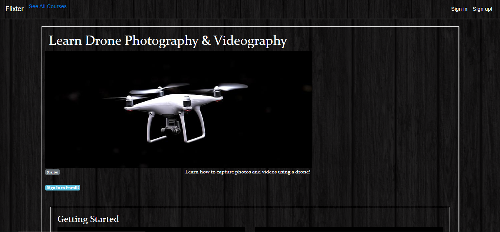
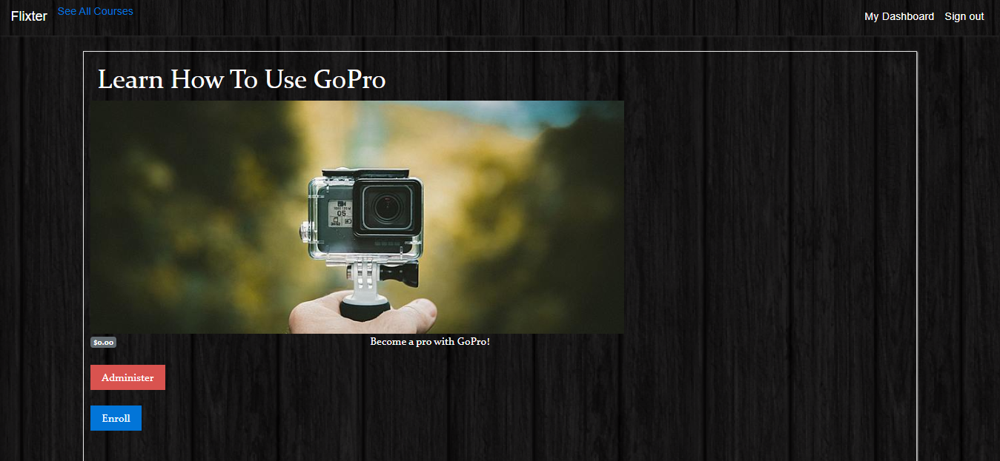
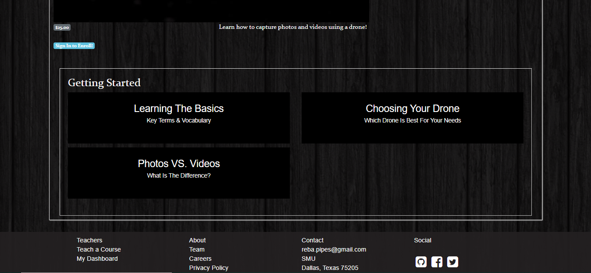
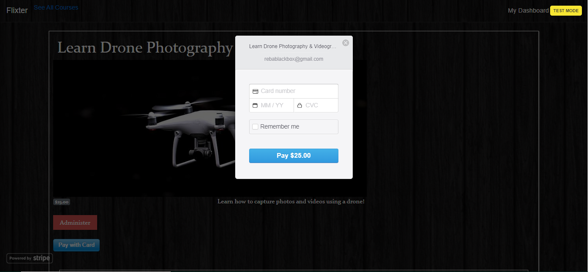

# Flixter

Flixter is a two-sided, video-streaming marketplace platform that features credit card payment capabilities, user role management, complex user interfaces, and advanced database relationships. Uses Git and GitHub for version control, and deployed via Heroku.

Home/Landing Page

Courses

Courses Continued

Learn More

Lessons

Stripe API integration

## Getting Started

* Clone the repository
* Run bundle install
* Create and migrate the PotgreSQL database with rake db:create and rake db:migrate
* Start the server using rails server -b 0.0.0.0 -p 3000
* Run the app on localhost:3000

### Prerequisites

* Rails v. 5.0.0
* Ruby v. 2.6.3
* PostgreSQL
* HTML
* CSS/SCSS

## Deployment

Deployed using Heroku (https://www.heroku.com)

* Navigate to https://flixter-reba-pipes.herokuapp.com
* Use guest login or signup
* Guest login information:
    Email/Username: testemail@testing.com
    Password: 123456

## Built With

* Ruby on Rails
* JavaScript
* Stripe API
* Amazon Web Services API (AWS/S3)

## Features

* User authenitcation (Devise)
* Video hosting
* Course enrollment and student dashboard
* Administrative dashboard
* Payments with Stripe API
* Amazon Web Services API (AWS/S3)

## Meta

Reba Pipes

Email: pipes.reba@gmail.com

LinkedIn: (https://linkedin.com/in/rebapipes)

GitHub: (https://github.com/rebapipes/flixter)

Heroku: (https://flixter-reba-pipes.herokuapp.com)

Portfolio: (https://rebapipes.netlify.com)

Medium Blog: (https://medium.com/@rebapipes)

## Contributing

Reba Pipes (https://github.com/rebapipes)

## Versioning

Git & GitHub used for versioning (https://github.com/) 

## Authors

Reba Pipes (https://github.com/rebapipes)

## License

This project is licensed under the MIT License - see the [LICENSE.md](LICENSE.md) file for details